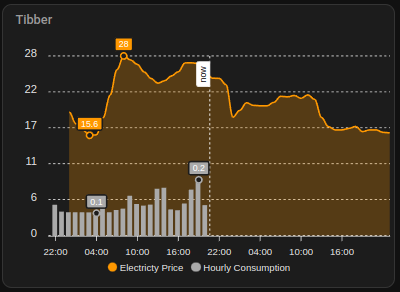
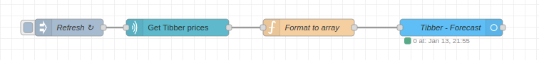
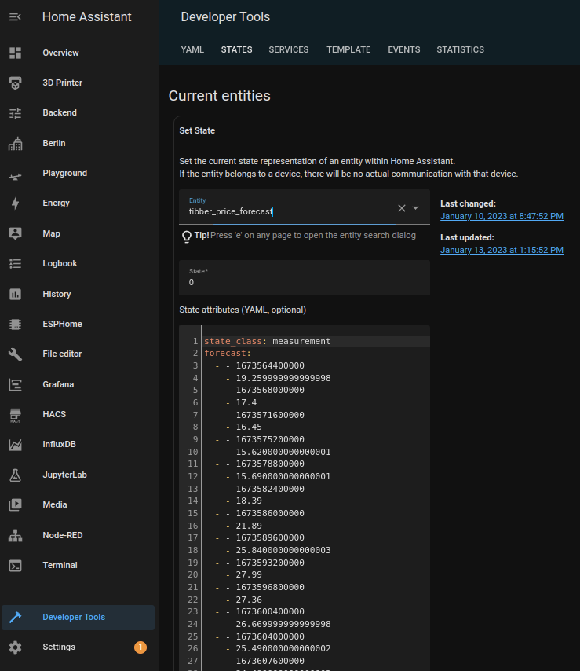
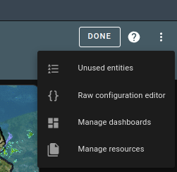

# How to integrate Tibber into Home-Assistant

**Tibber** is a Norwegian-based electricity provider (operating in several European countries) that offers a dynamic (hourly) electricity tariff (<a href="https://tibber.com">website</a>). As I could not find complete instructions to integrate its API in home-assistant, I figured out my own solution which I am sharing here. 

This includes (so far) a chart showing electricity prices (current and forecasted), plus measured consumption.

The solution requires installing the following additional components:
+ apex-cards 
+ Node-RED Add-On

## Showing Electricity Prices and Consumption

The tibber API provides data about the energy cost for each hour of the current and the next day. Home Assistant's Lovelace GUI does however not provide any cards able to display future sensor values out of the box, making it necessary to install some community-based extensions.

A searching for a solution quickly lead to the <a href="https://github.com/RomRider/apexcharts-card">ApexCharts Card</a> by <a href="https://github.com/RomRider">RomRider</a> which is a very versatile and highly adjustable chart for HASS and to all my knowledge currently the only option to display future data in HASS.

To display the data from the tibber API requires some pre-processing however. I am using <a href="https://nodered.org">Node-RED</a> (a browser-based low-code automation environment) which can be installed as a HASS Add-On and is useful for other automation tasks as well.

### Setup of the Price Forecast

**Package Installation**

First we need to install the required additional components:

+ In the **Devices and Services** Section of the HASS Settings, install the ***Tibber*** integration.
+ Follow the <a href="https://github.com/RomRider/apexcharts-card">installation instructions</a> for the **ApexChart card** . After Installation, check if *Custom: ApexCharts Card* appears in the list of available cards (check my note at the end of this document if it does not work).
+ Node-Red can be installed from the Add-On Section in the HASS Settings menu if available. Note this is not possible if running HASS as a container, in this case you need to install Node-Red as a container manually.

***Installing the Tibber Integration***

To access the Tibber API, sign up on their <a href="tibber.com">website</a> and create an API key. Use this API key to activate the Tibber Integration in HASS.

***Accessing the API using Node-RED***

Open Node-Red (from the HASS Sidebar or the Add-On section in Settings).

If you are completely unfamiliar with Node-RED, it is advisable to at least go through this <a href="https://nodered.org/docs/tutorials/">very basic tutorial</a> first. You won't regret :).

We are getting away with a very simple flow here as there is already a package to pull data from the API. This can be installed from the Pallete ("Burger Menu" in the upper right -> Manage Pallete). 

+ Search for `node-red-contrib-tibber-api` (<a href="https://flows.nodered.org/node/node-red-contrib-tibber-api">more info</a>) on the install tab and press install. After the installation is complete, you should find a *Tibber API* section on the left side-bar.

+ Unless you have installed node-red as an Add-On, you also need to install the `node-red-contrib-home-assistant-websocket` package in the same way, plus the companion node-red integration (<a href="hhttps://github.com/zachowj/hass-node-red">more info</a>) in HASS.

Finally, choose *Import* from the burger menu on the top right and import the `flow-price.json` file in this repository. This should create the following nodes:

The first two nodes regularly pull new data from the Tibber API (I use 20 min intervall - mind the API rate limit!). The third nodes brings the API data into the right format to be written to the fourth node, which is a custom entity in HASS. 

To make it work,

+ in the settings of the *Get Tibber prices* node, create/configure an endpoint using you API key, and
+ You may also have to re-initialize the home assistant configuration
+ Hit **Deploy** to start the flow.
+ To check if it works, check the state of the entity in the Developer Tools, which should  look similar to the screenshot below: 

*(Note that the data is actually living in an attribute of the entity, the state is always assigned as zero as a dummy value. This is done because the state variable is limited to a size not allowing all this data to be stored)*

**Setup in Home Assistant**

To show the data in HASS, add a new *Manual* Card to your dashboar and paste the code from the `config-chart.yaml` file and replace the sensor name `sensor.last_meter_consumption_$$YOURHOMENAME$$` with the respective sensor that your tibber integration has created.

This should be it! The result should look like this.

## Notes 

+ The `sensor.last_meter_consumption_$$YOURHOMENAME$$` sensor is only available if you have a smart-meter or Tibber Pulse device active. In my case, the API only started sending consumption data on the day after I have first installed the device, so be patient.

+ I am writing this a few days after development from the top of my head and have not tested this procedure a second time. if something does not work, feel free to create an issue; however be warned I am notorously bad at replying :)

+ Somebody with more JavaScript abilities than myself might be able to integrate the code from my node-red code directly into the generator function of the apex-chart; which would elminate the need for node-red. If you figure that out, please share or let me know, I am happy to publish this here.

+ The tibber API documentation does not state any difference between different countries, however be aware that I am on the German energy market in case something if you do some trouble shooting. You may have to adjust the currency, but I am sure you figured that out already :)

+ On ApexCharts installation: I installed this through HACS and ran into the issue, that the URL to be set was different than the one stated in the installation instructions. Using `/hacsfiles/apexcharts-card/apexcharts-card.js` instead of `/local/apexcharts-card.js?v=2.0.2` did the trick for me. This can be changed in the Manage Resources panel (see screenshot below)
+ 